# [The Recipe Vault](https://flask-cookbook-app-a80af878055f.herokuapp.com)

## Introduction

- The Recipe Vault is a web application that allows users to create, store and share recipes.
- The application is designed to veer away from physical cookbooks and instead focus on the concept of recipes.
- Users must create an account to access the application's full features.

## Mockup

| This is a mockup of the Recipe Vault application, showcased using Am I Responsive? |
| --- |
| 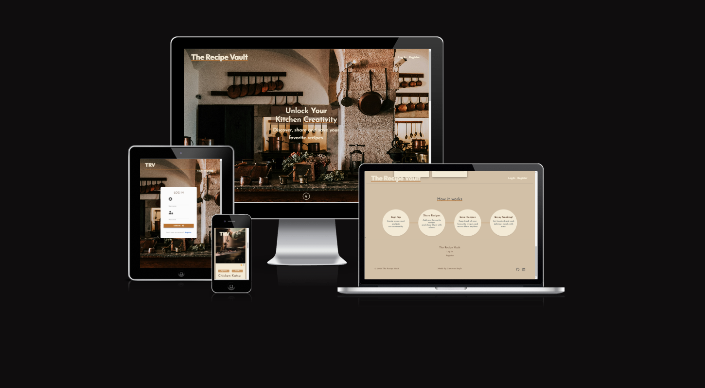 |

## Table of Contents

- [The Recipe Vault](#the-recipe-vault)
  - [Introduction](#introduction)
  - [Mockup](#mockup)
  - [Table of Contents](#table-of-contents)
  - [User Experience](#user-experience)
    - [Colour Scheme](#colour-scheme)
    - [Typography](#typography)
    - [User Stories](#user-stories)
      - [New User](#new-user)
      - [Returning User](#returning-user)
      - [Admin](#admin)
    - [User Feedback](#user-feedback)
  - [Wireframes](#wireframes)
    - [Landing Page](#landing-page)
    - [Recipe Search](#recipe-search)
    - [Sign Up](#sign-up)
    - [Profile](#profile)
  - [Features](#features)
    - [Existing Features](#existing-features)
    - [Future Features](#future-features)
  - [Technologies](#technologies)
    - [Frontend](#frontend)
    - [Backend](#backend)
    - [Database](#database)
  - [Database Schema](#database-schema)
  - [Testing](#testing)
  - [Deployment](#deployment)
    - [Heroku](#heroku)
    - [MongoDB Atlas](#mongodb-atlas)
    - [Local](#local)
      - [Cloning the Repo](#cloning-the-repo)
      - [Forking the Repo](#forking-the-repo)
  - [Credits](#credits)
    - [Images](#images)
    - [Content](#content)
    - [Acknowledgements](#acknowledgements)

## User Experience

### Colour Scheme

| Colour Scheme |
| --- |
| - #D2C0A7 - 'Warm Beige' Used as the primary colour |
| - #F7B65A - 'Muted Copper' Used as the main hover colour |
| - #593D2B - 'Rich Brown' Used as the secondary colour |
| - #F3EAD6 - 'Soft Cream' Used as primary text colour |
| - #36454F - 'Deep Charcoal' Used as secondary text colour |
| - I also used variations of these colours to darken/lighten some elements |

[coolor.co](https://coolors.co/palette/d2c0a7-f7b65a-593d2b-36454f-f3ead6) was used to generate the colour palette.

I swapped the fancier names for colours with more neutral names to make the colour palette more accessible.

```css
:root {
  /* Colours */
  --primary-colour: #D2C0A7; /* Warm Beige */
  --text-colour: #593D2B; /* Rich Brown */
  --hover-colour: #B87333; /* Muted Copper */
  --text-one: #F3EAD6;  /* Soft Cream */
  --text-two: #36454F; /* Deep Charcoal */

}
```

This was my first time using CSS variables, and I'm happy with how they work.

### Typography

I used [Google Fonts](https://fonts.google.com/) to generate the typography for the application.

I used the following font families:

- [Josefin Sans](https://fonts.google.com/specimen/Josefin+Sans) was used as the body font.
- [Outfit](https://fonts.google.com/specimen/Outfit) was used as the heading font.
- [Font Awesome](https://fontawesome.com/) was used for icons.

```html
<link
    href="https://fonts.googleapis.com/css2?
        family=Josefin+Sans:ital,wght@0,100..700;1,100..700
        &family=Outfit:wght@100..900&display=swap"
    rel="stylesheet">
```

### User Stories

#### New User

- As a new user, I want to be able to create an account so that I can access the full features of the application.
- As a new user, I want to be able to create a recipe so that I can store and share my recipes with others.
- As a new user, I want to be able to save other users' recipes so that I can access them later.
- As a new user, I want to search for recipes by name, description, ingredients, cuisine and dietary restrictions so that I can find the recipe I am looking for.

#### Returning User

- As a returning user, I want to be able to log in so that I can access the full features of the application.
- As a returning user, I want to be able to create a recipe so that I can store and share my recipes with others.
- As a returning user, I want to be able to save other users' recipes so that I can access them later.
- As a returning user, I want to search for recipes by name, description, ingredients, cuisine and dietary restrictions so that I can find the recipe I am looking for.
- As a returning user, I want to be able to edit my profile so that I can update my information.
- As a returning user, I want to be able to edit my recipes.
- As a returning user, I want to be able to delete my recipes.
- As a returning user, I want to be able to contact the site administrator so that I can report bugs or request features.

#### Admin

- As an admin, I want to be able to delete inappropriate recipes so that I can maintain the quality of the application.
- As an admin, I want to be able to edit recipes so that I can maintain the quality of the application.
- As an admin, I want to be able to add/delete categories upon user requests.

### User Feedback

 "**This app is easy to navigate and aesthetically pleasing! I like that I can store all of my recipes on one website as well as browse and learn from others. Being able to personalise my profile with a bio makes it that little bit more sentimental. I would like there to be a feature where I can upload a profile picture to my profile and a picture of my recipe to its respective card, so I look forward to that being a future feature.**"- Mica Ali

## Wireframes

For help with responsive design and optimal practice, I created wireframes for desktop, tablet, and mobile devices using [Balsamiq](https://balsamiq.com/).

<details>
<summary>Click for wireframes</summary>

### Landing Page

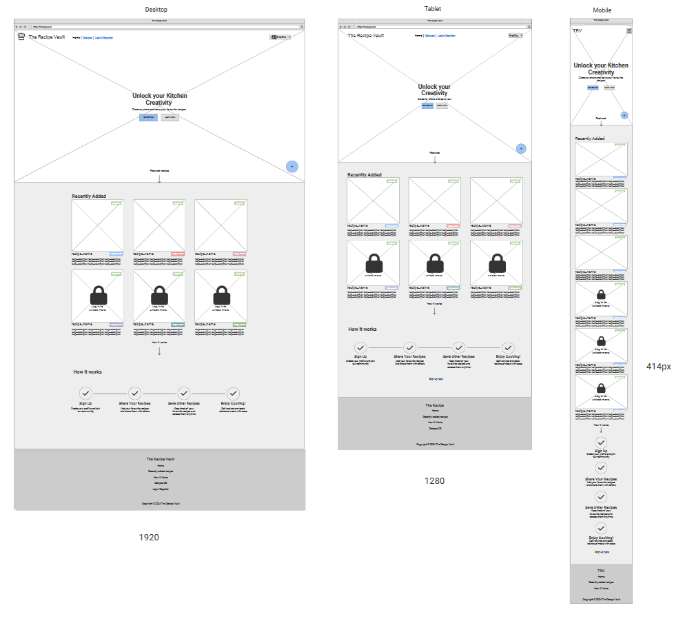

### Recipe Search

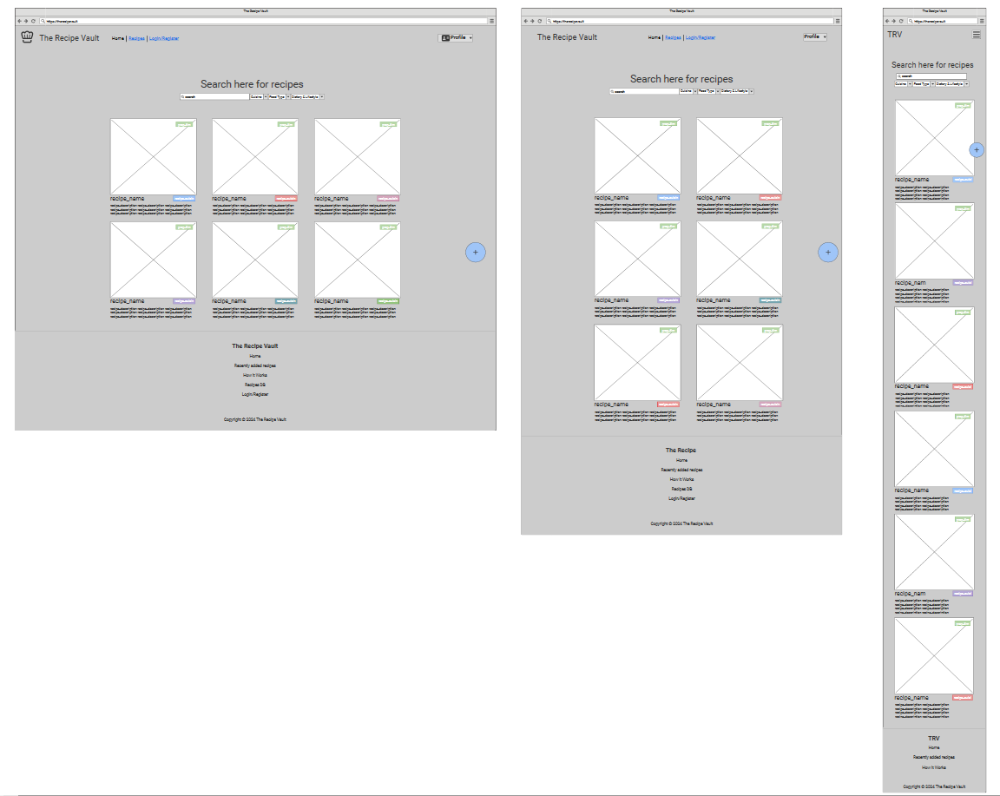

### Sign Up

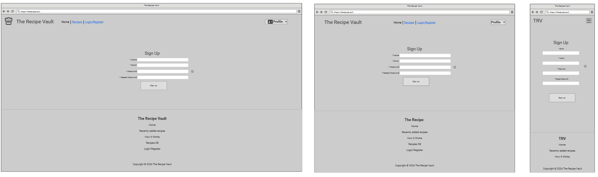

### Profile

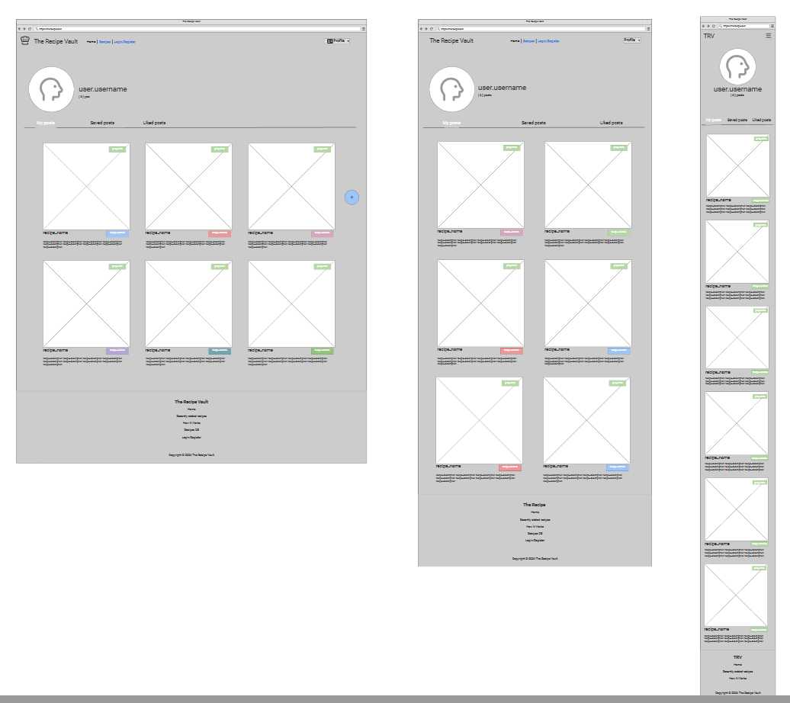

</details>

## Features

Here are some of the features that I implemented in the application, took out and planned for future features.

### Existing Features

<details>
<summary>Existing features</summary>

| Feature | Description | Image |
| --- | --- | --- |
| Favicon | The favicon is a small image that represents the website and is displayed in the browser tab. | |
| Site Logo | The site is logo is just the site name, The Recipe Vault. | 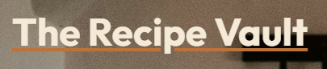 |
| Site Logo (Small) | This logo is shortened to just TRV on small screens.|  |
| Navigation Bar | The navigation bar is located at the top of the page and contains links to the main sections of the site. |  |
| Navigation Bar (Small) | This navigation bar is compressed to a collapsed state on small screens. | 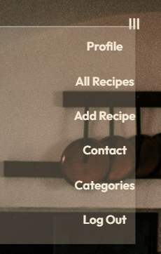 |
| Hero | The hero section contains the the tagline, an image, and a button to navigate to the recipes page. | 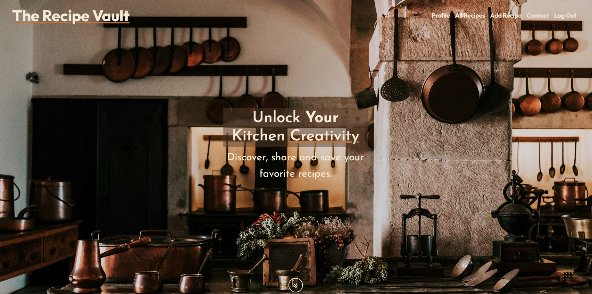 |
| To-Recipes Button | This button smooth-scrolls to the recipes page. | 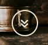 |
| Recently Added Recipes | This section displays the most recently added recipes. | 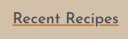 |
| Search Recipes | This section allows the user to search for recipes by name, description, ingredients, cuisine, and dietary restrictions. | 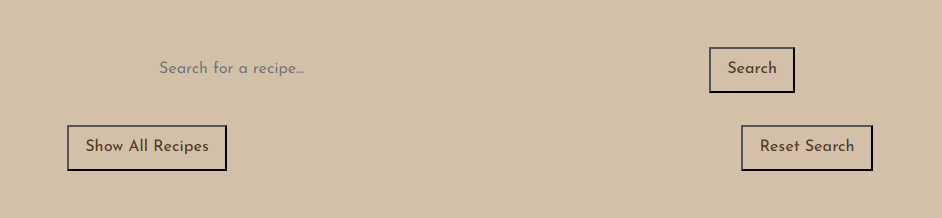 |
| Show All Recipes | This button directs the user to the all recipes page. | 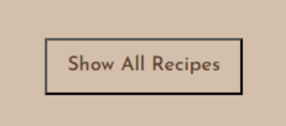 |
| Reset Search | This button resets the search input field. | 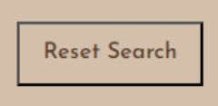 |
| Recipe Cards | The recipe cards are displayed in a grid format and contain the recipe name, description, ingredients, cuisine, and dietary restrictions. And can be clicked to view the rest of the recipe details. | 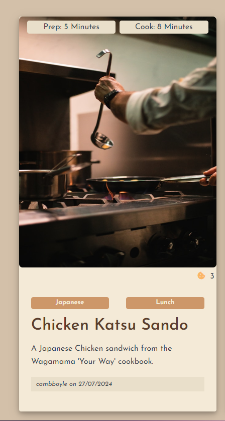 |
| View Recipe | This page displays the whole recipe, here, the user can like and save the recipe | 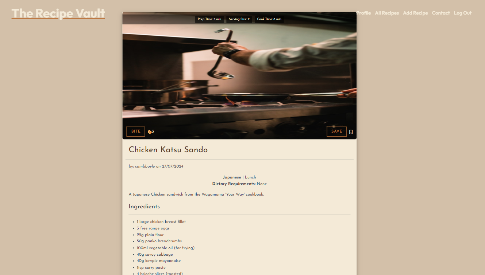 |
| Like Recipes | This button allows the user to like the recipe, which will increase the likes count by one. | 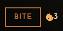 |
| Save Recipes | This button allows the user to save the recipe, which will add the recipe to their saved recipes on their profile. | 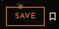 |
| How it Works | This section of the landing page descrbies how to utilize the site. | 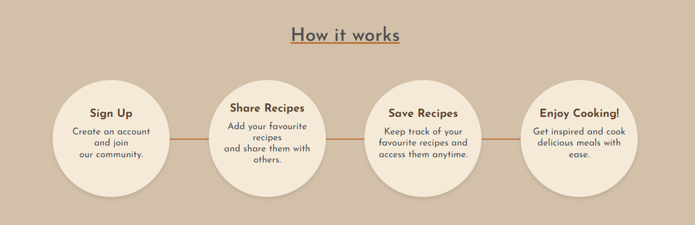 |
| Footer | The footer contains a navigation bar, a copyright notice, and social media links. | 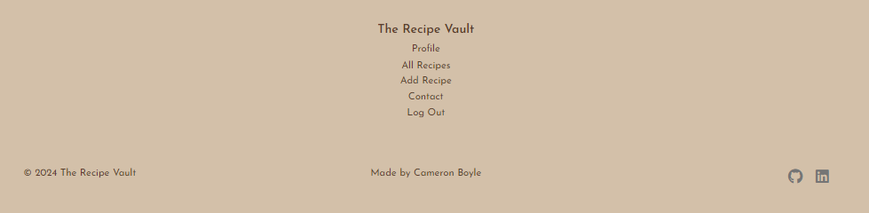 |
| Register | This page allows the user to create an account on the site. | 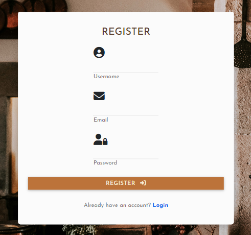 |
| Login | This page allows the user to log in to their account if they have an account. | 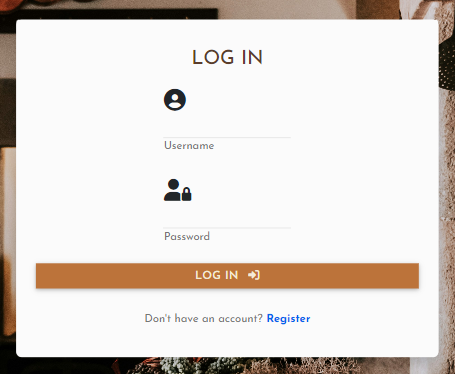 |
| Profile | This page displays the user's profile, which includes their username, recipes, saved recipes, and bio. |  |
| Edit Bio | This button enables the user to edit their bio. | 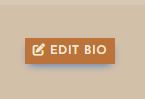 |
| User Recipes | This tab displays the user's recipes. | 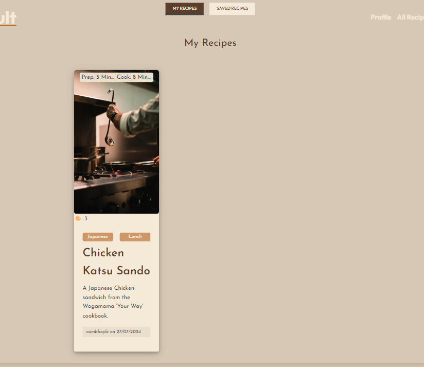 |
| Saved Recipes | This tab displays the user's saved recipes. | 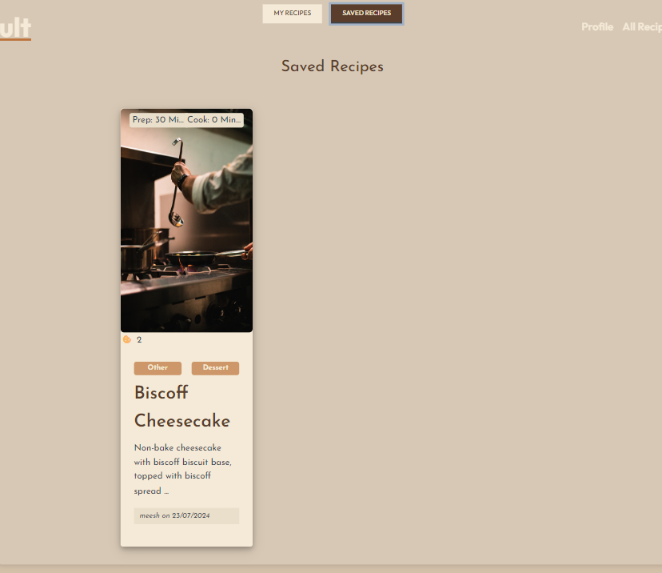 |
| Add Recipe | This page allows the user to create a new recipe, which includes the recipe name, category, recipe description, serving size, prep time, cooking time, dietary restrictions, meal type, main ingredients, and recipe method. | 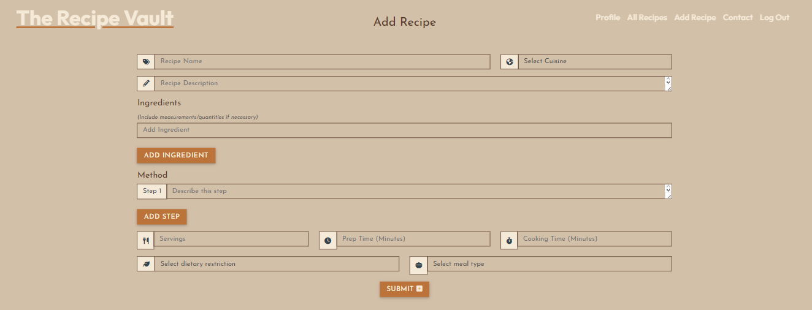 |
| Recipe Dropdowns (Categories, Meal Types, Dietary Restrictions) | These dropdowns allow the user to select pre-defined categories, meal types, and dietary restrictions. | 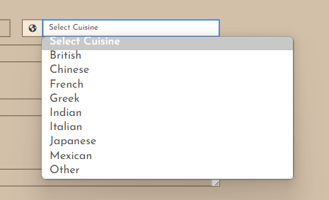 |
| Edit Recipe | This page is opened via the View Recipe page, which allows the user to edit the recipe details. | 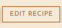 |
| Delete Recipe | This button prompts the user to confirm the deletion of the recipe. | 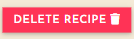 |
| Contact Form | This page allows the user to contact the site administrator. | 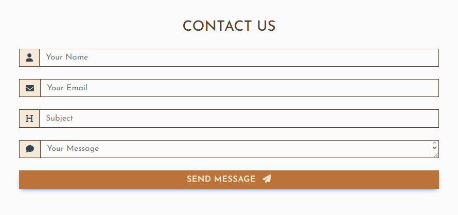 |
| Email from Contact Form | This page displays an email to the site administrator, which includes the user's name, email, subject and message. | 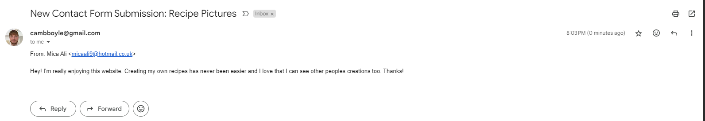 |
| Flash Messages | Flash messages are displayed to the user when certain actions are performed, such as successfully logging in, successfully registering, or successfully editing a recipe. | 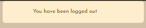 |
| ADMIN ONLY | ADMIN ONLY | ADMIN ONLY |
| Categories | This page displays the list of categories that the site administrator has created. | 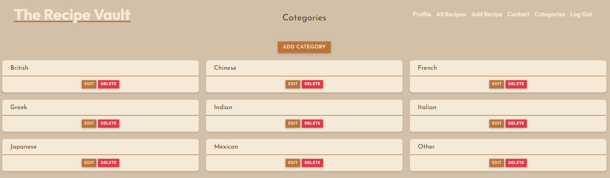 |
| Add Category | This page allows the site administrator to create a new category. | 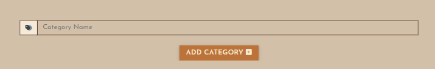 |
| Edit Category | This page allows the site administrator to edit a category. | 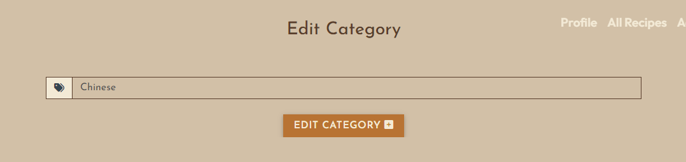 |
| Delete Category | Clicking the delete button prompts the user to confirm the deletion of the category. | 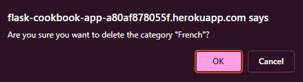 |

</details>

### Future Features

<details>
<summary>Future features</summary>

- Profile Picture: Allow users to upload their own profile picture. (See [TESTING.md](TESTING.md) for more information.)
- Recipe Images: Allow users to upload their own recipe images.
- Recipe ratings and reviews: Allow users to rate recipes and leave reviews.
- Meal planning: Implement a feature that lets users plan their meals for the week using saved recipes.
- Grocery list generator: Create a tool that generates a shopping list based on selected recipes.
- Nutritional information: Add calorie counts and nutritional facts for each recipe.
- Recipe scaling: Allow users to adjust serving sizes and automatically recalculate ingredient quantities.
- Cooking timer: Integrate a timer feature for each step of the recipe.
- Recipe collections or cookbooks: Let users create and share collections of recipes.
- Social sharing: Add buttons to share recipes on social media platforms.
- Ingredient substitutions: Provide suggestions for ingredient substitutions for dietary restrictions or preferences.
- Video tutorials: Include short video clips demonstrating cooking techniques or complex steps.
- Seasonal recipe recommendations: Highlight recipes based on seasonal ingredients or holidays.
- User-generated content: Allow users to submit their own recipes for review and publication.
- Recipe print functionality: Create a printer-friendly version of recipes.
- Advanced search filters: Implement more detailed search options such as cooking time, difficulty level, or dietary restrictions.
- Recipe version control: Allow users to create personal variations of recipes and track changes.

</details>

## Technologies

### Frontend

- [HTML](https://developer.mozilla.org/en-US/docs/Web/HTML)
- [CSS](https://developer.mozilla.org/en-US/docs/Web/CSS)
- [JavaScript](https://developer.mozilla.org/en-US/docs/Web/JavaScript)
- [Bootstrap 5](https://getbootstrap.com/)
- [MDB](https://mdbootstrap.com/)
- [Font Awesome](https://fontawesome.com/)
- [JQuery](https://jquery.com/)

### Backend

- [Python](https://www.python.org/)
- [Flask](https://flask.palletsprojects.com/en/2.3.x/)
- [Flask-Mail](https://pythonhosted.org/Flask-Mail/)
- [Flask-PyMongo](https://flask-pymongo.readthedocs.io/en/2.4/)
- [Flask-Script](https://flask-script.readthedocs.io/en/latest/)
- [Heroku](https://www.heroku.com/)

### Database

- [MongoDB](https://www.mongodb.com/)
- [MongoDB Atlas](https://www.mongodb.com/atlas)

## Database Schema

Below are my database schemas for the MongoDB Atlas database.

<details>
<summary>Click for database schemas</summary>

| Collection | Field | Type | Description |
| --- | --- | --- | --- |
| **users** | | | |
| | _id | ObjectId | The unique identifier of the user. |
| | username | String | The username of the user. |
| | email | String | The email address of the user. |
| | password | String | The password of the user. Encrypted using werkzeug.security.generate_password_hash. |
| | bio | String | The bio of the user. |
| **recipes** | | | |
| | _id | ObjectId | The unique identifier of the recipe. |
| | recipe_name | String | The name of the recipe. |
| | category_name | String | The category of the recipe. |
| | recipe_description | String | The description of the recipe. |
| | serving_size | String | The serving size of the recipe. |
| | prep_time | String | The prep time of the recipe. |
| | cooking_time | String | The cooking time of the recipe. |
| | dietary | String | The dietary restrictions of the recipe. |
| | meal_type | String | The meal type of the recipe. |
| | main_ingredients | Array | The main ingredients of the recipe. |
| | recipe_method | Array | The recipe method of the recipe. |
| | liked_by | Array | The users who liked the recipe. |
| | likes | Number | The number of likes the recipe has received. |
| | created_by | ObjectId | The user who created the recipe. |
| | created_at | Date | The date and time the recipe was created. |
| **saved_recipes** | | | |
| | _id | ObjectId | The unique identifier of the saved recipe. |
| | user | String| The user who saved the recipe. |
| | recipe_id | ObjectId | The unique identifier of the recipe. |
| | saved_at | Date | The date the recipe was saved. |
| **categories** | | | |
| | _id | ObjectId | The unique identifier of the category. |
| | category_name | String | The name of the category. |
| **dietary_requirements** | | | |
| | _id | ObjectId | The unique identifier of the dietary requirement. |
| | dietary_name | String | The name of the dietary requirement. |
| **meal_type** | | | |
| | _id | ObjectId | The unique identifier of the meal type. |
| | meal_type | String | The name of the meal type. |
| **saves** | | | |
| | _id | ObjectId | The unique identifier of the save. |
| | user | String | The user who saved the recipe. |
| | recipe_id | ObjectId | The unique identifier of the recipe. |
| | saved_at | Date | The date the recipe was saved. |

</details>

## Testing

Please see the [TESTING.md](TESTING.md) file for more information.

## Deployment

The live version of the site is hosted on Heroku, here: [LIVE SITE](https://flask-cookbook-app-a80af878055f.herokuapp.com/).

### Heroku

The project is hosted on Heroku.

Follow the steps below to deploy the project to Heroku:

1. Select "New" from the Heroku dashboard, and choose "Create new app".
2. Choose a name for your app, and select the region you want to deploy to, then click on "Create app".
3. From the settings tab in the app, click on "Reveal Config Vars" to set the environment variables.

| Key | Value |
| --- | --- |
| DATABASE_URL | The URL of your MongoDB database. |
| IP | 0.0.0.0 |
| MONGO_DBNAME | The name of your MongoDB database. |
| MONGO_URI | The URI of your MongoDB database. |
| PORT | 5000 |
| SECRET_KEY | A secret key for your Flask app. |

Now you must create two files that Heroku needs to deploy the project properly:

- A Procfile file that tells Heroku what commands to run when the app is deployed.
- A requirements.txt file that lists the Python packages that your app depends on.

You can create these files by running the following commands:

```bash
touch Procfile # Make sure there is no extension and the file is capitalized
touch requirements.txt
```

Once you have created these files, you can add the following lines to the Procfile file:

```bash
web: python3 app.py
```

And use this command to write the requirements.txt file:

```bash
pip3 freeze --local > requirements.txt
```

Now you can deploy the project to Heroku by either:

- running the following commands in your terminal:

```terminal
heroku login -i
```

Then set the remote to Heroku:

```terminal
heroku  git:remote -a <your-app-name>
```

Finally, push the code to Heroku after you have made any changes:

```terminal
git push heroku main
```

- or by clicking on the automic deploy button in the Heroku dashboard.

You should now be able to access the site at the URL provided by Heroku.

### MongoDB Atlas

The project uses MongoDB Atlas, which is a cloud-based database service used to handle my non-relational data.

To create a MongoDB Atlas Database, follow these steps:

1. Go to the [MongoDB Atlas website](https://www.mongodb.com/atlas/database) and sign up for a free account.
2. Once you have created an account, go to the [Databases](https://www.mongodb.com/atlas/database/overview) page and click on the "Create Cluster" button.
3. Choose a cluster name and region, and click on the "Create Cluster" button.
4. Once the cluster is created, click on the collections tab.
5. Click "Create Database" and choose a database name.
6. Now click on create collection and choose a collection name.
7. Inside the collection, you can write your data.
8. Once you have written out some data, go to the overview tab and click on the "connect" button.
9. In the connect modal, click on the "View full instructions" button.
10. On this page, follow the instructions to connect to the database.

### Local

The project can be run locally by following the steps below:

For either option, you will need to install the packages found in the requirements.txt file.

In your terminal, run the following command to install the packages:

```terminal
pip3 install -r requirements.txt
```

At root level of your project, you will need to create an env.py file that contains the following:

```python
import os

os.environ,setdefault("IP", "0.0.0.0")
os.environ.setdefault("MONGO_DBNAME", "<your-database-name>")
os.environ.setdefault("MONGO_URI", "<your-database-uri>")
os.environ.setdefault("PORT", "5000")
os.environ.setdefault("SECRET_KEY", "<your-secret-key>")
```

This file will not be tracked by git, so you can add it to your .gitignore file.

#### Cloning the Repo

To clone The Recipe Vault, follow the steps below:

1. Go to the [GitHub repository](https://github.com/cambboyle/the-recipe-vault) and click on the "Code" button.
2. Select your preferred method of cloning the repository and copy the URL.
3. Open your terminal and navigate to the directory where you want to clone the repository.
4. In your terminal, run the following command to clone the repository: `git clone https://github.com/cambboyle/the-recipe-vault.git`
5. Once the repository is cloned, navigate to the cloned directory: `cd the-recipe-vault`
6. From here you can run the commands from the Local section.
7. To run the project locally, run the following command: `python3 app.py`

#### Forking the Repo

To fork the repository, follow the steps below:

1. Go to the [GitHub repository](https://github.com/cambboyle/the-recipe-vault) and click on the "Fork" button.
2. Once the repo is forked, you should now have a copy of the repository on your own GitHub account where you can make changes and submit pull requests without affecting the original repository.

## Credits

### Images

Example of recipe (used in recipe cards by default) by <a href="https://unsplash.com/@duanemendes?utm_content=creditCopyText&utm_medium=referral&utm_source=unsplash">Duane Mendes</a> on <a href="https://unsplash.com/photos/person-holding-stainless-steel-spoon-JrRoJlGyZwk?utm_content=creditCopyText&utm_medium=referral&utm_source=unsplash">Unsplash</a>
  
Testing hero image by <a href="https://unsplash.com/@fsuarez?utm_content=creditCopyText&utm_medium=referral&utm_source=unsplash">Francisco Suarez</a> on <a href="https://unsplash.com/photos/stainless-steel-cooking-pots-on-stove-0EkWTSFXwCc?utm_content=creditCopyText&utm_medium=referral&utm_source=unsplash">Unsplash</a>
  
Hero Image by <a href="https://unsplash.com/@alexkurchev?utm_content=creditCopyText&utm_medium=referral&utm_source=unsplash">Oleksandr Kurchev</a> on <a href="https://unsplash.com/photos/kitchen-filled-with-cooking-pans-and-kitchen-utensils-9gtiGV76NnM?utm_content=creditCopyText&utm_medium=referral&utm_source=unsplash">Unsplash</a>

<a href="https://www.flaticon.com/free-icons/ramen" title="ramen icons">Ramen icons</a> created by Freepik - Flaticon

Photo by <a href="https://unsplash.com/@thomas?utm_content=creditCopyText&utm_medium=referral&utm_source=unsplash">Thomas Marban</a> on <a href="https://unsplash.com/photos/man-in-chef-suit-EHK-EH1SRzQ?utm_content=creditCopyText&utm_medium=referral&utm_source=unsplash">Unsplash</a>
  

### Content

Tab Structure on Profile Page from <a href="https://mdbootstrap.com/docs/standard/navigation/tabs/">MDB </a>

<a href="https://mdbootstrap.com/docs/standard/">MDB</a> Documentation

<a href="https://getbootstrap.com/docs/5.3/">Bootstrap 5</a> Documentation

<a href="https://www.mongodb.com/atlas/database/overview">MongoDB Atlas</a> Documentation

<a href="https://devcenter.heroku.com/articles/getting-started-with-python">Heroku</a> Documentation

<a href="https://flask.palletsprojects.com/en/2.3.x/">Flask</a> Documentation

<a href="https://flask-pymongo.readthedocs.io/en/2.4/">Flask-PyMongo</a> Documentation

<a href="https://pythonhosted.org/Flask-Mail/">Flask-Mail</a> Documentation

<a href="https://stackoverflow.com/">StackOverflow</a> for countless hours of help and guidance.

Perplexity AI for help with AJAX and Flask Mail.

<a href="https://codepen.io/Ragnarokkr/pen/DWQPPM">Vignetter</a> added to the Hero Section.

### Acknowledgements

Mitko (My Mentor) for giving crucial feedback and guidance throughout the project.

Mica (My partner) for keeping me motivated and pushing me to complete the project.
