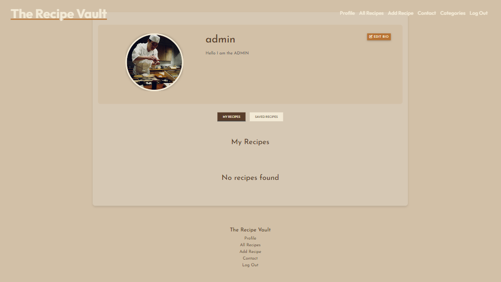
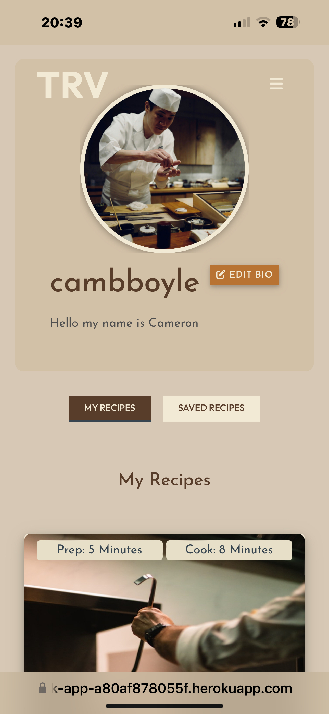
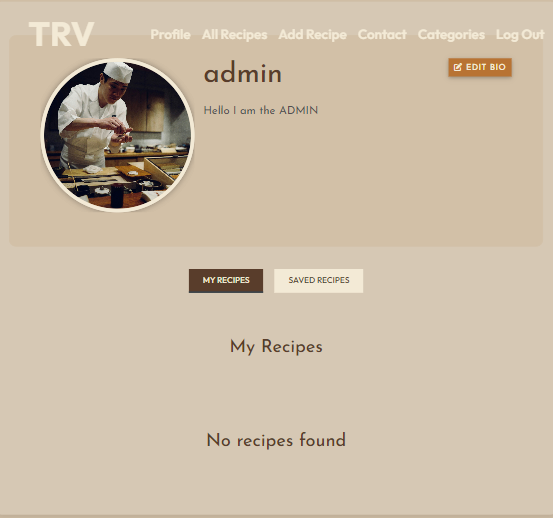

# TESTING

Click here to return to the [README.md](README.md) file.

## Table of Contents

- [VALIDATION](#validation)
- [RESPONSIVE DESIGN](#responsive-design)
- [LIGHTHOUSE TESTING](#lighthouse-testing)
- [DEFENSIVE PROGRAMMING](#defensive-programming)
- [KNOWN BUGS](#known-bugs)
- [FIXED BUGS](#fixed-bugs)

## VALIDATION

The validation for the project was done using the following tools:

### Python Validation (PEP8)

### JavaScript Validation (JSHint)

### CSS Validation (W3C CSS Validator)

The errors are not critical, but it is good to know that they are there.

### HTML Validation (W3C HTML Validator)

The errors here are only appearing because there are multiples recipes on the page, they are not real duplicate errors. They are being utlised using jinja2 templating.

## RESPONSIVE DESIGN

The project was tested on multiple devices and screen sizes to ensure that it is responsive and looks good on all devices.

Click for device testing

### Desktop 1920x1080

| Page | Screenshot |
| --- | --- |
| Landing Page (Hero) |  |
| Recipe Search |  |
| How it Works |  |
| Profile |  |
| Add Recipe |  |
| Edit Recipe |  |
| Contact |  |
| Login |  |
| Register |  |
| Categories |  |
| All Recipes |  |
| View Recipe |  |

### Mobile (iPhone 14 Pro Max)

| Page | Screenshot |
| --- | --- |
| Landing Page (Hero) |  |
| Recipe Search |  |
| How it Works |  |
| How it Works & Footer |  |
| Profile |  |
| Add Recipe |  |
| Edit Recipe |  |
| Contact |  |
| Login |  |
| Register |  |
| Categories |  |
| All Recipes |  |

### Tablet (iPad Air)

| Page | Screenshot |
| --- | --- |
| Landing Page (Hero) |  |
| Recipe Search |  |
| How it Works |  |
| Profile |  |
| Add Recipe |  |
| Edit Recipe |  |
| Contact |  |
| Login |  |
| Register |  |
| Categories |  |
| All Recipes |  |

## LIGHTHOUSE TESTING

### Desktop Lighthouse

### Mobile Lighthouse

## DEFENSIVE PROGRAMMING

Defensive Programming was tested manually, and the results were as follows:

Click for defensive programming testing

| | Expected Behavior | Test | Actual Behavior |
| --- | --- | --- | --- |
| **General** | | | |
| Text Boxes | Minimum & Maximum lenght on input boxes | Tested by typing characters in a text box that exceeds the minimum or maximum length | When form is submitted, validation message is displayed |
| Password Regex | Expected to only accept characters in the regex | Tested by typing characters that do not match the regex | When form is submitted, validation message is displayed |
| URL change | Redirect user to login page if URL is changed | Tested by changing the URL in the browser | Redirected to the login page |
| **Non-logged in users** | | | |
| Home Button | Expected to redirect to the home page | Tested by clicking the button | Redirected to the home page |
| Login Button | Expected to redirect to the login page | Tested by clicking the button | Redirected to the login page |
| Register Button | Expected to redirect to the register page | Tested by clicking the button | Redirected to the register page |
| Search Function | Expected to search through the user's query | Tested by typing a query in the search bar | Searched through the user's query |
| Recipe Card | Expected to redirect to the single recipe page | Tested by clicking the card | Redirected to the single recipe page |
| **Logged in users** | | | |
| Home Button | Expected to redirect to the home page | Tested by clicking the button | Redirected to the home page |
| Profile Button | Expected to redirect to the profile page | Tested by clicking the button | Redirected to the profile page |
| All Recipes Button | Expected to redirect to the all recipes page | Tested by clicking the button | Redirected to the all recipes page |
| Add Recipe Button | Expected to redirect to the add recipe page | Tested by clicking the button | Redirected to the add recipe page |
| Contact Button | Expected to redirect to the contact page | Tested by clicking the button | Redirected to the contact page |
| Contact Form | Expected to a message to the default email address | Tested by filling out the form | A message was sent to the default email address |
| Logout Button | Expected to redirect to the login page and log the user out | Tested by clicking the button | Redirected to the login page and successfully logged out the user |
| Search Function | Expected to search through the user's query | Tested by typing a query in the search bar | Searched through the user's query |
| Recipe Card | Expected to redirect to the single recipe page | Tested by clicking the card | Redirected to the single recipe page |
| Edit Recipe Button | Expected to redirect to the edit recipe page | Tested by clicking the button | Redirected to the edit recipe page |
| Delete Recipe Button | Expected to delete the recipe | Tested by clicking the button | Deleted the recipe |
| Save Recipe Button | Expected to save the recipe to the user's saved recipes | Tested by clicking the button | Saved the recipe to the user's saved recipes |
| Like Recipe Button | Expected to like the recipe and increment the like count | Tested by clicking the button | Liked the recipe and incremented the like count |
| **Admin Only** | | | |
| Categories Button | Expected to redirect to the categories page | Tested by clicking the button | Redirected to the categories page |
| Add Category Button | Expected to redirect to the add category page | Tested by clicking the button | Redirected to the add category page |
| Edit Category Button | Expected to redirect to the edit category page | Tested by clicking the button | Redirected to the edit category page |
| Delete Category Button | Expected to delete the category | Tested by clicking the button | Deleted the category |

## KNOWN BUGS

Encountered a bug where the profile picture was not being stored in the database, I tried fixing this by creating a S3 bucket and using the AWS SDK to upload the file to the bucket, but I was unable to get it to work. As I don't have enough experience with AWS, I decided to leave it as is.

I can upload pictures from my IDE and on localhost, but when I try to upload them from Heroku, they are not uploaded.

I have removed the ability to upload profile pictures from the project, as I was unable to get it to work with Heroku.

## FIXED BUGS

### Bug 1

One bug was fixed in the project, which was a bug in the recipe editing page.

The add ingredient/step button was not creating more ingredients/steps when clicked.

This was fixed in by adding the appropriate JavaScript code from the script.js file to the edit_recipe.html file.

The issue also persisted on the add recipe page, so this was also fixed.

### Bug 2

I encountered a bug when deleting a recipe, after clicking the delete button, the user was redirected to a black page, with one line of JSON in it. 
